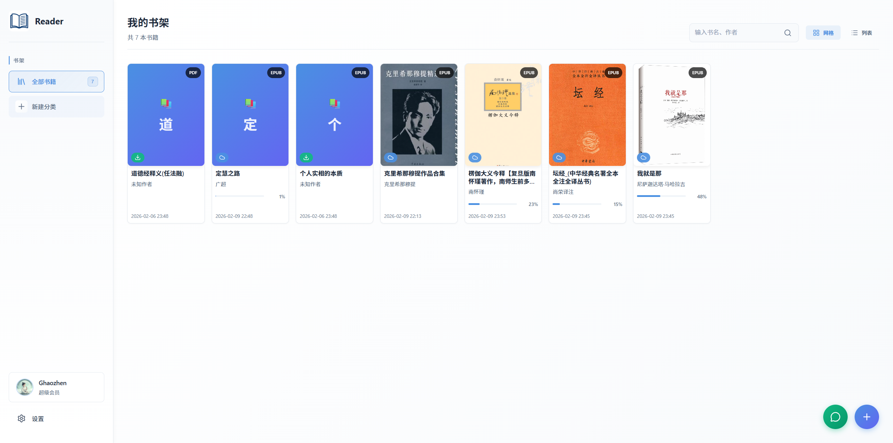

## Neat Reader

简洁优雅的桌面级电子书阅读器，支持 EPUB / PDF、本地文件与百度网盘书库，并集成 Qwen AI 阅读助手与 TTS 朗读。

> ⚠️ 仍在积极开发中，API 与 UI 可能会有调整。

<p align="center">
  <!-- 可以替换为真实仓库链接 -->
  <a href="https://github.com/your-name/Neat-Reader">
    
  </a>
  
  
  
</p>


---

### 目录

- [特性](#特性)
- [技术栈](#技术栈)
- [预览截图](#预览截图)
- [目录结构](#目录结构)
- [环境准备](#环境准备)
- [快速开始](#快速开始)
  - [安装依赖](#安装依赖)
  - [开发模式启动](#开发模式启动)
  - [构建与打包](#构建与打包)
- [配置与密钥管理](#配置与密钥管理)
- [代码阅读指引](#代码阅读指引)
- [常见问题 FAQ](#常见问题-faq)
- [贡献指南](#贡献指南)
- [License](#license)
- [English Quick Overview](#english-quick-overview)

---

### 特性

- **多格式阅读支持**
  - 支持 EPUB（基于 `epubjs` / `@ray-d-song/foliate-js`）与 PDF（基于 `pdfjs-dist`）
  - 书签、进度、主题等阅读体验增强（见 `frontend/src/pages/Reader` 相关逻辑）

- **百度网盘书库**
  - 借助后端 `backend/src/routes/baidu.js` 与 `baiduService`，支持：
    - 授权登录
    - 文件列表 / 搜索 / 下载 / 上传

- **Qwen AI 阅读助手**
  - 通过 `backend/src/routes/qwen.js` & `qwenService` 对接 Qwen OAuth 与对话接口
  - 支持设备码登录、模型列表获取、流式对话（SSE）等
  - 前端在阅读器侧边栏/悬浮按钮中集成 AI 聊天与问答能力

- **TTS 朗读**
  - 后端 `backend/src/routes/tts.js` 提供文本转语音能力
  - 前端 `TTSSettings`、阅读器组件内集成朗读控制

- **跨平台桌面应用**
  - 使用 `electron` + `electron-builder` 打包
  - 支持 Windows / macOS / Linux（见根目录 `build:*` 脚本）

---

### 技术栈

- **桌面端**：Electron 28+（根目录）、Electron 40+（前端开发依赖）
- **前端**：Vue 3、Vue Router、Pinia、Vite、TypeScript
- **阅读内核**：`epubjs`、`@ray-d-song/foliate-js`、`pdfjs-dist`
- **后端**：Node.js + Express，路由与服务位于 `backend/src`
- **其它**：Axios、dayjs、localforage、uuid、lucide-vue-next 等

---

### 预览截图

> 在 GitHub 上展示时，可以放几张关键页面截图（主页、阅读器、AI 面板等）。  
> 例如：
>
> ```md
> 
> 
> ```

---

### 目录结构

```text
Neat-Reader/
  backend/            # Node/Express 后端
    src/
      routes/         # baidu / qwen / tts API 路由
      services/       # 第三方服务封装逻辑
      utils/          # 日志、端口占用处理等工具
      server.js       # 后端入口，默认端口 3001

  electron/           # Electron 主进程代码
    main.js           # 创建主窗口、CSP、高级授权窗口等
    preload.js        # 预加载脚本，桥接渲染进程与主进程
    menu.js           # 应用菜单定义（如有）

  frontend/           # Vue 3 + Vite 前端
    src/
      pages/
        Home/         # 主页
        FileManager/  # 文件管理与导入
        Reader/       # 阅读器页面及组件（AI、TTS、主题等）
      components/     # 公共 UI 组件（对话框、设置面板、聊天窗口等）
      stores/         # Pinia 状态管理（如 `ebook`、`dialog`）
      api/            # 与 backend 的 API 适配层
      utils/          # Token 管理、工具函数等

  build/              # 打包资源（图标等）
  package.json        # 根目录脚本：安装、开发、打包
  electron-builder.json
  README.md
```

---

### 环境准备

- Node.js 18+（建议）  
- npm 或兼容包管理器（项目脚本以 `npm` 为例）  
- 已配置的：
  - 百度网盘开放平台应用（用于 OAuth）
  - Qwen 账号与相关 OAuth 配置

> 注：具体的 ClientId / Secret / 回调地址等敏感信息不应提交到仓库，请放在 `.env` 或本地配置文件中，后端服务通过环境变量或配置文件读取。

---

### 快速开始

#### 安装依赖

在项目根目录执行（自动为前端与后端安装依赖）：

```bash
npm install
```

`package.json` 中定义了：

- `postinstall`:  
  - 进入 `frontend` 执行 `npm install`
  - 进入 `backend` 执行 `npm install`

---

#### 开发模式启动

在根目录运行：

```bash
# 启动前后端 + Electron
npm run dev
```

该脚本会：

- 启动后端：`npm run dev:backend`（默认端口 `http://localhost:3001`，见 `backend/src/server.js`）
- 启动前端：`npm run dev:frontend`（Vite，默认 `http://localhost:5173`）
- 待前端可用后，启动 Electron 主进程：`npm run dev:electron`，加载 `http://localhost:5173`

你也可以分别启动：

```bash
npm run dev:backend   # 只启动后端
npm run dev:frontend  # 只启动前端（浏览器访问 5173）
npm run dev:electron  # 只启动 Electron（需要前端已启动）
```

---

#### 构建与打包

前端打包（生成至 `frontend/dist`）：

```bash
npm run build:frontend
```

后端生产环境依赖安装：

```bash
npm run build:backend
```

桌面应用打包（调用 `electron-builder`）：

```bash
# 通用
npm run build

# 或指定平台
npm run build:win
npm run build:mac
npm run build:linux
```

打包完成后，可在相应输出目录中找到安装包 / 可执行文件。

---

### 配置与密钥管理

根据后端代码（如 `backend/src/services/*`）与第三方平台文档，你通常需要配置以下信息：

- **百度网盘**
  - `clientId` / `clientSecret` / `redirectUri`
  - OAuth 授权回调地址需与 `electron/main.js` 中授权窗口的回调处理保持一致
  - 可通过 `alistgo` 相关 API 简化 Refresh Token 获取流程（见 `baidu.js` 中 `/alist-token` 路由）

- **Qwen**
  - OAuth / Device Code Flow 配置（在 `qwenService` 中使用）
  - 设备码授权页面 URL 与回调 URL 需要与 Qwen 平台设置对应

推荐做法：

- 在 `backend` 中使用 `.env` 或 `config.*.json` 管理密钥
- 使用 `.gitignore` 忽略本地配置文件，避免泄漏

---

### 代码阅读指引

- 想了解**阅读器内核与 UI**：  
  查看 `frontend/src/pages/Reader` 下的：
  - `components/`：`FoliateReader.vue`、`PdfReader.vue`、`AIChatPanel.vue`、`TextSelectionMenu.vue` 等
  - `composables/`：`useReaderTheme.ts`、`useReaderProgress.ts`、`useTextToSpeech.ts` 等

- 想了解**AI / TTS 能力如何接入**：  
  - 前端：`frontend/src/api`、`frontend/src/components/ChatWindow`、`TTSSettings` 等
  - 后端：`backend/src/routes/qwen.js`、`backend/src/routes/tts.js` 与对应 `services`

- 想了解**存储与状态管理**：  
  - `frontend/src/stores/ebook.ts` 等 Pinia Store
  - `localforage` 在本地缓存中的使用

- 想了解 **Electron 与前端的交互**：  
  - `electron/main.js` 中的 `ipcMain.handle(...)`（文件选择、授权窗口等）
  - `preload.js` 中暴露给渲染进程的 API

---

### 常见问题 FAQ

- **Q: 启动 `npm run dev` 后 Electron 窗口白屏或无法打开？**  
  - 请确认 Vite 前端是否成功启动（`http://localhost:5173` 可访问）  
  - 检查终端输出是否有端口占用或依赖安装失败

- **Q: 后端接口请求失败 / 401 / 5xx？**  
  - 检查后端控制台日志（`backend/src/utils/logger.js`）  
  - 确认百度 / Qwen 配置是否正确、是否已完成授权流程  
  - 确认本地网络可访问对应的第三方服务

- **Q: 如何自定义 UI / 主题？**  
  - 查看 `frontend/src/pages/Reader/styles/theme.css` 与全局样式 `frontend/src/assets/styles/global.css`  
  - 可在此基础上添加新主题或调整配色

---

### 贡献指南

欢迎通过以下方式参与改进项目（未来可以补充 CONTRIBUTING 文档）：

- 提交 Issue，反馈 Bug 或提出新功能建议
- 提交 Pull Request：
  - 保持代码风格与现有项目一致
  - 尽量在前后端分别添加必要的注释
  - 如果改动较大，建议先开 Issue 讨论

---

### License

本项目使用 **MIT License**，详见仓库中的 `LICENSE` 文件。

---

### English Quick Overview

Neat Reader is an Electron-based desktop ebook reader (EPUB / PDF) built with Vue 3 and an Express backend.  
It integrates Baidu Netdisk as a remote library and Qwen AI for reading assistance and text-to-speech.  

**Development**

```bash
npm install
npm run dev
```

**Build**

```bash
npm run build        # generic build
npm run build:win    # Windows
npm run build:mac    # macOS
npm run build:linux  # Linux
```

For more details, please refer to the source code and comments under `backend/src`, `frontend/src`, and `electron/`.

