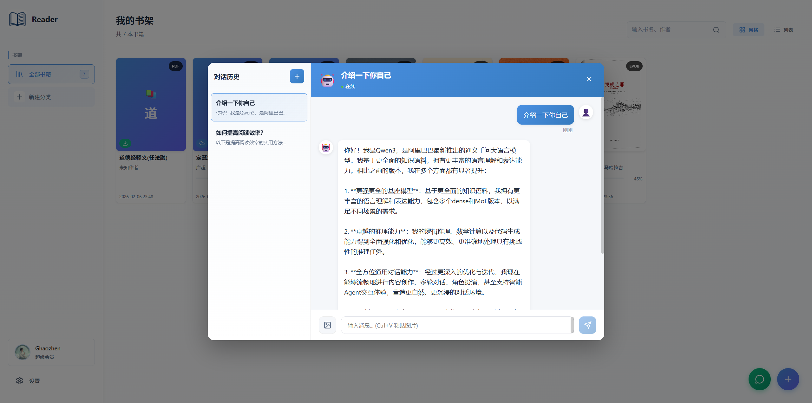
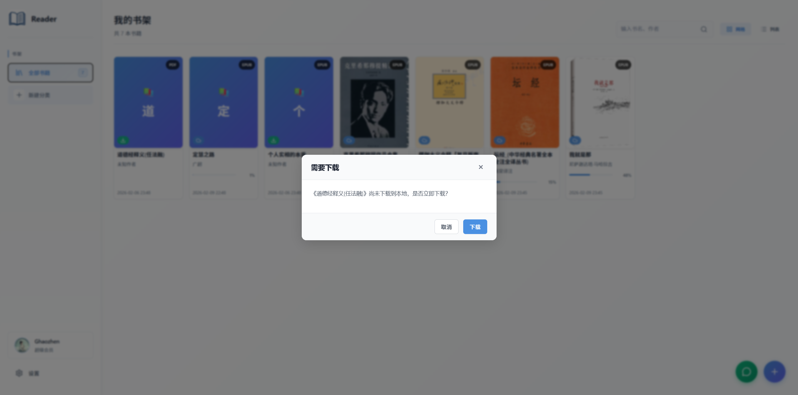
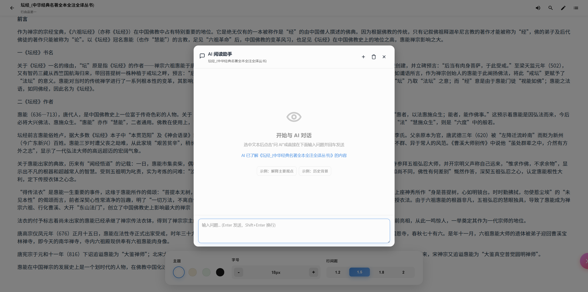
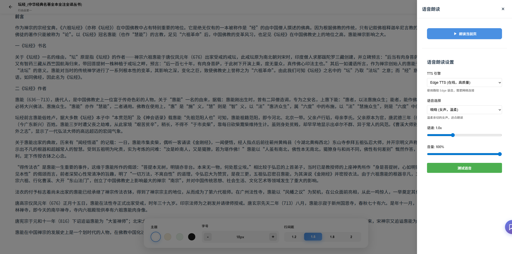

# Neat Reader

<div align="center">

**简洁优雅的跨平台电子书阅读器**

基于 Electron + Vue 3 构建，支持 EPUB 和 PDF 格式

[](LICENSE)
[](https://nodejs.org/)
[](https://www.electronjs.org/)

[功能特性](#-功能特性) • [快速开始](#-快速开始) • [技术栈](#-技术栈) • [文档](#-文档)

</div>

---

## 📖 简介

Neat Reader 是一个功能完整的桌面电子书阅读器，提供流畅的阅读体验和强大的云同步功能。

## ✨ 功能特性

### 核心功能
- 📚 **多格式支持** - EPUB、PDF 电子书阅读
- 🎨 **阅读体验** - 4种主题（浅色/护眼/绿色/深色）、字体调节、亮度控制
- 📊 **进度管理** - 自动保存阅读进度（CFI 精确定位），支持书签和笔记
- 🏷️ **分类管理** - 自定义书籍分类，智能组织
- 🔍 **全文搜索** - 快速搜索本地和云端书籍

### AI 智能功能 ✨
- 🤖 **AI 阅读助手** - 集成通义千问 AI，智能解答阅读疑问
- 💬 **上下文对话** - 基于书籍内容和选中文本的智能对话
- 📝 **Markdown 渲染** - AI 回复支持完整 Markdown 格式（代码高亮、表格、列表等）
- 💾 **对话历史** - 每本书独立保存对话记录，随时回顾
- 🎯 **文本选择问答** - 选中文本后直接提问，精准回答

### 语音朗读 🔊
- 🗣️ **TTS 支持** - 文本转语音，支持多种语音引擎
- 🌐 **Edge TTS** - 高质量在线语音合成（29种中文语音）
- 🎵 **语音控制** - 播放/暂停、语速调节、音量控制
- 📖 **连续朗读** - 自动翻页，持续朗读

### 云端功能
- ☁️ **百度网盘集成** - OAuth 2.0 安全授权
- 🔄 **云端同步** - 书籍和阅读进度云端备份
- 📥 **一键下载** - 云端书籍快速下载到本地
- 🔐 **智能缓存** - 用户信息缓存，减少 API 调用









## 🚀 快速开始

### 环境要求

- Node.js 16+ ([下载](https://nodejs.org/))
- npm 或 yarn

### 一键安装（推荐）

**Windows:**
```cmd
install.bat
```

**macOS/Linux:**
```bash
chmod +x install.sh && ./install.sh
```

安装脚本会自动配置国内镜像源，解决 Electron 下载问题。

### 启动应用

```bash
npm run dev
```

应用会自动打开，同时启动：
- 前端开发服务器：http://localhost:5173
- 后端 API 服务器：http://localhost:3001

### 手动安装

```bash
# 安装依赖
npm install

# 启动开发模式
npm run dev
```

## 🛠️ 技术栈

### 桌面框架
- **Electron 28+** - 跨平台桌面应用

### 前端技术
- **Vue 3.5** - 组合式 API
- **TypeScript 5.6** - 类型安全
- **Pinia 2.2** - 状态管理
- **Vue Router 4.4** - 路由管理（Hash 模式）
- **Vite 6** - 构建工具
- **@ray-d-song/foliate-js** - EPUB 渲染引擎（iframe 支持）
- **epub.js 0.3.93** - EPUB 解析
- **pdf.js 5.4** - PDF 渲染
- **localforage 1.10** - IndexedDB 封装
- **marked** - Markdown 渲染
- **lucide-vue-next** - 图标库

### 后端技术
- **Node.js + Express 5.2** - HTTP 服务器
- **Axios 1.6** - HTTP 客户端
- **Multer 2.0** - 文件上传
- **CORS 2.8** - 跨域支持

## 📦 开发命令

```bash
# 开发模式（推荐）
npm run dev                 # 启动所有服务

# 单独启动
npm run dev:frontend        # 前端开发服务器
npm run dev:backend         # 后端 API 服务器
npm run dev:electron        # Electron 窗口

# 构建应用
npm run build               # 构建所有平台
npm run build:win           # Windows
npm run build:mac           # macOS
npm run build:linux         # Linux

# 其他命令
cd frontend && npm run typecheck  # TypeScript 类型检查
node scripts/check-env.js         # 环境检查
```

构建产物位于 `dist-electron/` 目录。

## 📁 项目结构

```
neat-reader/
├── electron/              # Electron 主进程
│   ├── main.js           # 应用入口、窗口管理
│   ├── preload.js        # 安全通信桥梁（contextBridge）
│   └── menu.js           # 应用菜单
├── backend/              # Express 后端服务
│   └── src/
│       ├── server.js     # HTTP 服务器（端口 3001）
│       ├── routes/       # API 路由
│       ├── services/     # 业务逻辑
│       │   ├── baiduService.js   # 百度网盘 API
│       │   ├── qwenService.js    # 通义千问 AI
│       │   └── ttsService.js     # TTS 语音合成
│       └── utils/        # 工具函数
├── frontend/             # Vue 3 前端应用
│   └── src/
│       ├── pages/        # 页面组件
│       │   ├── Home/     # 首页（书架、分类）
│       │   ├── Reader/   # 阅读器
│       │   │   └── components/
│       │   │       ├── FoliateReader.vue      # EPUB 阅读器
│       │   │       ├── PdfReader.vue          # PDF 阅读器
│       │   │       ├── BookAIChatPanel.vue    # AI 对话面板
│       │   │       ├── AIFloatingButton.vue   # AI 浮动按钮
│       │   │       └── TextSelectionMenu.vue  # 文本选择菜单
│       │   ├── FileManager/  # 文件管理
│       │   └── Settings/     # 设置（百度网盘、AI 配置）
│       ├── stores/       # Pinia 状态管理
│       │   └── ebook.ts  # 书籍、进度、AI 对话状态
│       ├── api/          # API 封装
│       │   ├── adapter.ts    # HTTP/IPC 适配器
│       │   ├── baidu.ts      # 百度网盘 API
│       │   ├── qwen.ts       # 通义千问 API
│       │   └── tts.ts        # TTS API
│       ├── components/   # 公共组件
│       └── utils/        # 工具函数
│           └── qwenTokenManager.ts  # AI Token 管理
└── package.json          # 根项目配置
```

## 🔧 配置指南

### 百度网盘授权

#### 获取授权

1. 在应用"设置"页面点击"获取授权"
2. 在弹出的授权窗口中登录百度账号
3. 授权成功后自动获取 token 并连接

#### 默认配置

应用使用 alist 提供的公共授权服务：
- Client ID: `hq9yQ9w9kR4YHj1kyYafLygVocobh7Sf`
- Redirect URI: `https://alistgo.com/tool/baidu/callback`

#### 取消授权

在设置页面点击"取消授权"即可断开连接。

### 通义千问 AI 配置

#### 授权方式说明

本应用使用 **Device Code Flow（设备码授权流程）** 进行通义千问 AI 授权，这是一种安全的 OAuth 2.0 授权方式，无需 API Key。

#### 授权步骤

1. **启动授权流程**
   - 在应用"设置"页面点击"通义千问 AI 授权"
   - 系统会生成一个设备码和授权链接

2. **完成授权**
   - 点击授权链接，在浏览器中打开
   - 登录你的通义千问账号
   - 确认授权

3. **自动获取 Token**
   - 授权成功后，应用会自动获取 access token
   - Token 会自动保存到本地
   - 系统会在 Token 过期前 3 小时自动刷新

#### 技术细节

- **授权协议**：OAuth 2.0 Device Code Flow + PKCE
- **安全增强**：使用 PKCE (Proof Key for Code Exchange) 防止授权码拦截
- **自动刷新**：Token 在过期前自动刷新，无需手动操作
- **API 端点**：使用 `chat.qwen.ai` 的官方 API（非 DashScope）

#### 功能说明

- **上下文理解**：AI 会自动获取当前页面内容和历史对话（最近 10 条消息）
- **文本选择问答**：选中文本后点击"问 AI"，基于选中内容提问
- **对话历史**：每本书独立保存对话记录，支持清空
- **Markdown 支持**：AI 回复支持代码块、表格、列表等格式
- **流式输出**：实时显示 AI 回复，无需等待完整响应

#### 使用技巧

- 选中关键段落后提问，获得更精准的回答
- 使用"清空对话"重新开始新话题
- AI 会记住最近 5 轮对话，保持上下文连贯
- 支持多轮对话，可以追问和深入讨论

#### 注意事项

- 首次授权需要通义千问账号（免费注册）
- Token 有效期通常为 30 天，系统会自动刷新
- 如果授权失败，请检查网络连接
- 授权信息仅保存在本地，不会上传到服务器

### TTS 语音配置

#### 支持的语音引擎

- **Edge TTS**（推荐）：高质量在线语音，29种中文语音
- **系统 TTS**：使用操作系统内置语音引擎

#### 使用方法

1. 在阅读器中点击"语音朗读"按钮
2. 选择喜欢的语音
3. 调节语速和音量
4. 点击播放开始朗读

#### 注意事项

- Edge TTS 需要网络连接
- 首次使用会下载语音数据
- 支持后台朗读，可以最小化窗口

## 🐛 常见问题

### Electron 下载失败

**问题**：`npm install` 时 Electron 下载超时或失败

**解决方案**：
```bash
# 方案 1：使用安装脚本（推荐）
install.bat  # Windows
./install.sh # macOS/Linux

# 方案 2：手动配置镜像
npm config set electron_mirror https://npmmirror.com/mirrors/electron/
npm config set registry https://registry.npmmirror.com
npm install

# 方案 3：使用 cnpm
npm install -g cnpm --registry=https://registry.npmmirror.com
cnpm install
```

### 端口被占用

**问题**：启动时提示端口 3001 或 5173 被占用

**解决方案**：
```bash
# Windows
netstat -ano | findstr :3001
taskkill /PID <进程ID> /F

# macOS/Linux
lsof -i :3001
kill -9 <进程ID>
```

或修改配置文件中的端口号：
- 后端：`backend/src/server.js`
- 前端：`frontend/vite.config.ts`

### 窗口显示空白

**问题**：Electron 窗口启动但显示空白

**解决方案**：
1. 确保前端服务器正常运行（http://localhost:5173）
2. 按 `Ctrl+Shift+I` 打开开发者工具查看错误
3. 尝试刷新：`Ctrl+R` (Windows) 或 `Cmd+R` (Mac)

## 📚 文档

- [构建指南](./BUILD_GUIDE.md) - 详细的构建和打包说明
- [端口配置](./docs/PORT_CONFIG.md) - 端口配置文档

## 🔄 架构说明

### 为什么迁移到 Electron？

**核心原因**：Wails 环境中 epub.js 的 iframe 渲染存在问题

**迁移收益**：
- ✅ EPUB 渲染问题完美解决
- ✅ 技术栈统一（全 JavaScript/TypeScript）
- ✅ 开发体验提升（Chrome DevTools）
- ✅ 生态系统成熟

**权衡**：
- ⚠️ 打包体积增加（~50MB → ~150MB）
- ⚠️ 内存占用增加（~50MB → ~150MB）

### 三层架构

```
┌─────────────────────────────────────┐
│   Electron 主进程 (main.js)         │
│   - 窗口管理                         │
│   - 系统交互                         │
│   - 启动后端服务器                   │
└─────────────────────────────────────┘
           │                 │
           ↓                 ↓
┌──────────────────┐  ┌──────────────────┐
│  Vue 3 前端      │  │  Express 后端    │
│  - 用户界面      │  │  - HTTP API      │
│  - 交互逻辑      │  │  - 百度网盘集成  │
│  - 状态管理      │  │  - 业务逻辑      │
└──────────────────┘  └──────────────────┘
```

## 🔐 安全性

- ✅ **Context Isolation** - 前端和主进程完全隔离
- ✅ **Node Integration 禁用** - 防止前端直接访问 Node.js
- ✅ **Preload 脚本** - 只通过 contextBridge 暴露必要 API
- ✅ **本地 API** - 后端只监听 localhost，不对外暴露
- ✅ **Token 安全** - AI 和云端 Token 本地加密存储
- ✅ **数据隔离** - 每本书的数据独立存储，互不干扰

## 🎯 性能优化

### 已实现的优化
- **书籍内容缓存** - 同一本书再次打开时使用内存缓存，避免重复读取 IndexedDB
- **View 实例重用** - Foliate 阅读器实例复用，减少初始化开销
- **CFI 精确恢复** - 使用 EPUB CFI 标准精确恢复阅读位置，避免多次跳转
- **智能加载** - 延迟加载非关键资源，优先显示内容
- **用户信息缓存** - 百度网盘用户信息缓存 5 分钟，减少 API 调用
- **对话历史优化** - AI 对话只保留最近 10 条消息，减少上下文长度

### 性能指标
- **首次打开书籍**：1-2 秒
- **再次打开同一本书**：< 100ms
- **进度恢复**：< 50ms
- **AI 响应**：流式输出，首字延迟 < 1 秒

## 🚧 开发路线

### 已完成 ✅
- [x] EPUB/PDF 阅读器
- [x] 百度网盘集成
- [x] 阅读进度同步（CFI 精确定位）
- [x] AI 阅读助手（通义千问）
- [x] TTS 语音朗读
- [x] Markdown 渲染
- [x] 书籍分类管理
- [x] 性能优化（缓存、懒加载）


## 📄 许可证

MIT License

<div align="center">

**当前版本**：1.0.0-electron  
**最后更新**：2026-02-09  
**状态**：✅ 功能完整，持续优化中

Made with ❤️ by Neat Reader Team

</div>
